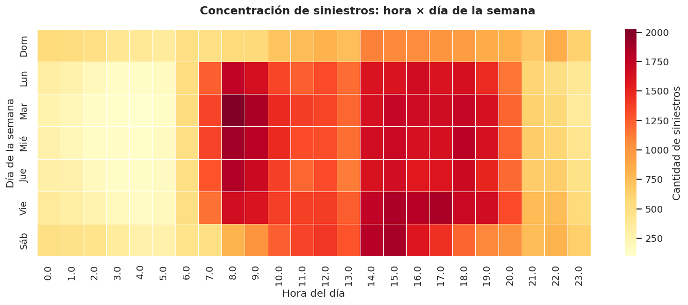
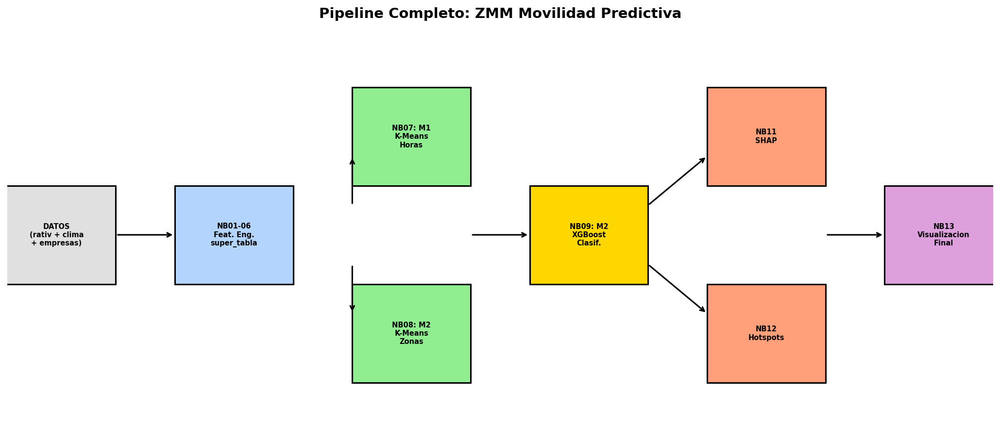
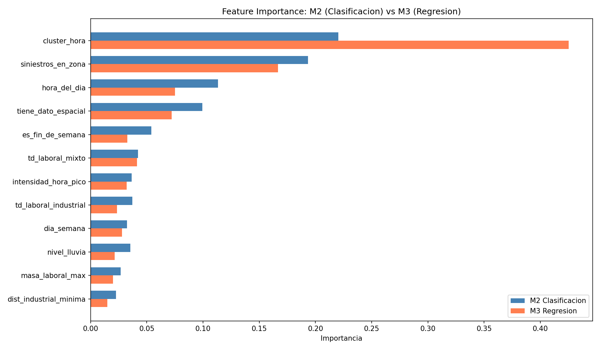
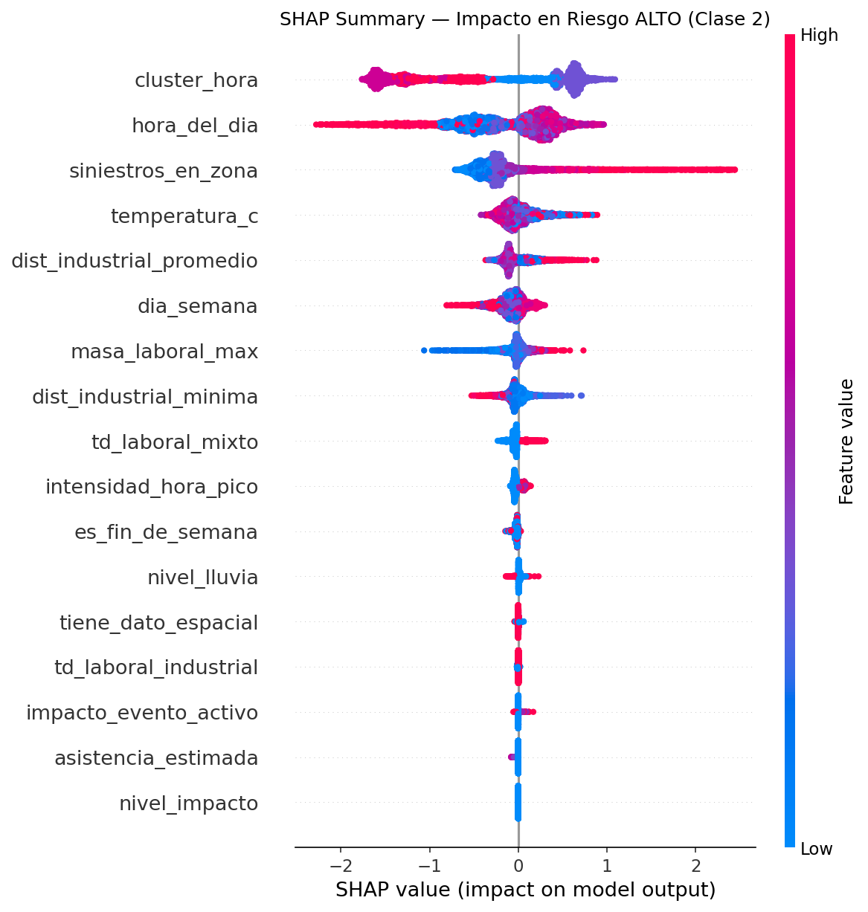
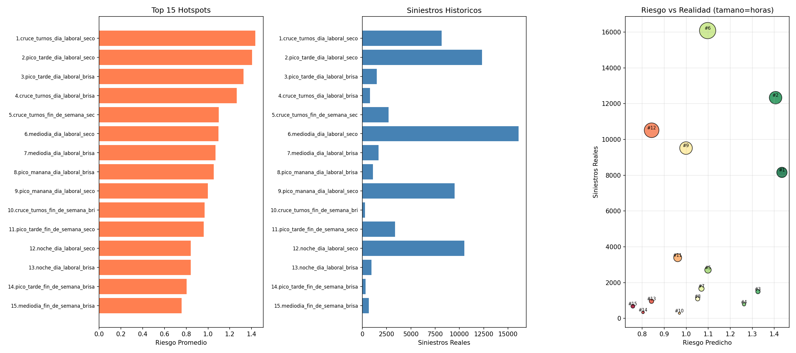

# ZMM Movilidad Predictiva


> **Predicción de riesgo vial en zonas industriales de la Zona Metropolitana de Monterrey.**

**En la ZMM ocurre un accidente vial cada 8 minutos. 1 de cada 4, a menos de 2 km de una zona industrial.**



*Heatmap de siniestros hora × día en la ZMM (2023–2025). El bloque rojo de 14–16h entre semana es el cruce de turnos industriales — no la hora pico tradicional de tráfico urbano.*

---

## 1. Contexto

La **Zona Metropolitana de Monterrey (ZMM)** es uno de los principales polos industriales del país y una de las regiones con mayor densidad de manufactura pesada en Latinoamérica. Para este proyecto se delimitó la ZMM industrial a **8 municipios** con presencia manufacturera verificada:

| Municipio | Código INEGI | Empresas DENUE industriales |
|-----------|--------------|-----------------------------|
| Apodaca | 6 | 533 |
| Guadalupe | 19 | 280 |
| Santa Catarina | 49 | 244 |
| General Escobedo | 18 | 208 |
| San Nicolás de los Garza | 46 | 204 |
| García | 21 | 80 |
| Pesquería | 41 | 45 |
| Juárez | 26 | 31 |

*Filtro SCIAN 31–33 (manufactura) y 48–49 (transporte) con >30 empleados. Ciénega de Flores y Salinas Victoria se excluyeron por datos insuficientes.*

El problema concreto: **alrededor de 68,000 siniestros de tránsito al año** en la ZMM, con un pico sostenido entre las 14:00 y 16:00 — horario que coincide con el cambio de turno de las plantas, no con el tráfico convencional. Esa dinámica industrial tiene efectos propios que el tráfico urbano general no captura.

---

## 2. La pregunta

### Pregunta original (v1)

> *¿Cuánto tiempo tardan los trabajadores en llegar a los parques industriales de la ZMM, y qué zonas entrarán en colapso vial crítico en los próximos 3 años?*

La idea inicial era construir un predictor de **tiempos de traslado** por zona industrial y hora. El problema apareció al buscar la fuente de datos:

- **TomTom:** solo cubría **5 de los 183 parques** del catálogo, sin histórico horario. Imposible cruzarla con la Super Tabla por `fecha_hora`.
- **Google Maps / Waze:** no ofrecen API pública para históricos masivos dentro del presupuesto del curso.
- **Datos gubernamentales:** no existen registros públicos de tiempos de traslado en la ZMM.

La variable objetivo `tiempo_traslado_min` **no existía y no era construible** con los datos disponibles. Se documentaron 4 opciones de contingencia (A/B/C/D); la opción viable fue pivotar.

### Pregunta actual (v2)

> *¿Qué tipologías de zonas industriales existen en la ZMM según su perfil de riesgo vial, qué factores contextuales determinan ese riesgo, y cómo se puede predecir cuándo y dónde es más peligroso conducir cerca de ellas?*

El pivot no fue capricho ni rescate: todo el feature engineering de NB01–NB06 ya estaba orientado a riesgo vial. Los **203,890 siniestros de OCISEVI con granularidad horaria** eran la señal más fuerte disponible, y los siniestros son un proxy directo de lo que el proyecto siempre quiso medir. Cambió la interpretación — de predecir *cuánto tardo* a predecir *dónde y cuándo es más peligroso* — pero la infraestructura de datos se reutilizó sin tocar una línea.

---

## 3. Datos

| Fuente | Contenido | Volumen |
|--------|-----------|---------|
| **OCISEVI / RATIV** | Siniestros de tránsito Nuevo León 2023–2025 | 203,890 registros |
| **DENUE INEGI** | Establecimientos industriales (SCIAN 31–33 / 48–49, >30 empleados) | 2,187 empresas → 183 zonas |
| **Open-Meteo API** | Clima histórico horario (temperatura, precipitación) | 35,064 horas |
| **Curaduría manual** | Eventos masivos (conciertos, partidos, ferias, convenciones) | 148 eventos |
| **OpenCage API** | Geocodificación con confidence ≥7 | auxiliar |

### Super Tabla maestra

**`super_tabla_completa.csv` — 35,064 horas × 29 variables.** Una fila por cada hora entre el 1 de enero de 2023 y el 31 de diciembre de 2026. Sin nulos, salvo **14,017 NaN reales** en 4 features espaciales (representan ausencia real de siniestros georreferenciados, no dato faltante — ver sección de Limitaciones).

Filtrada al rango de modelado 2023-01-01 → 2025-12-31 se obtiene la **`super_tabla_con_clusters.csv`** con 26,304 filas × 30 columnas que alimenta a M2 y M3.

---

## 4. Pipeline

El proyecto está estructurado en 13 notebooks numerados. **NB01–NB06** construyen la Super Tabla (feature engineering). **NB07–NB13** entrenan modelos, los explican y aterrizan los hallazgos.

| NB | Nombre | Rol | Estado |
|----|--------|-----|--------|
| 01 | [`01_EDA_DENUE.ipynb`](notebooks/01_EDA_DENUE.ipynb) | FE espacial — filtrado 2,187 establecimientos industriales | ✅ |
| 02 | [`02_Feature_Engineering_Tiempo.ipynb`](notebooks/02_Feature_Engineering_Tiempo.ipynb) | Esqueleto temporal 35,064 horas + calendario laboral | ✅ |
| 03 | [`03_Feature_Engineering_Clima.ipynb`](notebooks/03_Feature_Engineering_Clima.ipynb) | Integración Open-Meteo + 148 eventos masivos | ✅ |
| 04 | [`04_EDA_OCISEVI.ipynb`](notebooks/04_EDA_OCISEVI.ipynb) | Análisis 203,890 siniestros + tipología de accidente | ✅ |
| 05 | [`05_Feature_Engineering_OCISEVI.ipynb`](notebooks/05_Feature_Engineering_OCISEVI.ipynb) | Super Tabla 35,064 × 24 | ✅ |
| 06 | [`06_FE_zonas_industriales.ipynb`](notebooks/06_FE_zonas_industriales.ipynb) | Catálogo 183 zonas + BallTree Haversine 2 km | ✅ |
| 07 | [`07_ML_kmeans.ipynb`](notebooks/07_ML_kmeans.ipynb) | **M1** — K-Means K=5 sobre horas del día | ✅ |
| 08 | [`08_Clustering_Zonas_v2.ipynb`](notebooks/08_Clustering_Zonas_v2.ipynb) | Clustering de zonas industriales K=4 (silhouette 0.31) | ✅ |
| 09 | [`09_Modelo_Clasificacion_v2.ipynb`](notebooks/09_Modelo_Clasificacion_v2.ipynb) | **M2** — XGBoost clasifica BAJO/MEDIO/ALTO riesgo | ✅ |
| 10 | [`10_Modelo_Regresion_v2.ipynb`](notebooks/10_Modelo_Regresion_v2.ipynb) | **M3** — XGBoost predice conteo de siniestros por hora | ✅ |
| 11 | [`11_SHAP_Explicabilidad_v2.ipynb`](notebooks/11_SHAP_Explicabilidad_v2.ipynb) | Explicabilidad de M2 con SHAP TreeExplainer | ✅ |
| 12 | [`12_Hotspots_v2.ipynb`](notebooks/12_Hotspots_v2.ipynb) | Ranking de franjas horarias × contexto por riesgo | ✅ |
| 13 | [`13_Visualizaciones_v2.ipynb`](notebooks/13_Visualizaciones_v2.ipynb) | 4 visualizaciones consolidadas para presentación | ✅ |



*Los notebooks 08–13 se rehicieron como `v2` tras detectar overfitting severo y errores de mapeo en las versiones originales. Ver sección de Modelos.*

---

## 5. Modelos

### M1 — K-Means sobre horas del día (K=5)

Agrupa las 8,760 horas del año en 5 perfiles temporales:

1. **Día laboral activo** — horario de mayor actividad económica general.
2. **Madrugada tranquila** — 1–5 AM, bajo volumen.
3. **Horas con lluvia** — condiciones meteorológicas adversas.
4. **Eventos masivos** — horas bajo influencia de eventos nivel 3–4.
5. **Fin de semana** — dinámica residencial/recreativa.

**Hallazgo clave:** la hora pico **no forma un cluster propio**. Es una intensificación dentro del cluster de "día laboral activo". La columna `cluster_hora` se persistió como feature para M2 y M3 — donde SHAP la coronó como la variable más importante.

### M2 — XGBoost clasificación (BAJO / MEDIO / ALTO)

Predice el nivel de riesgo de una zona para una hora dada a partir de 17 features contextuales. Target discretizado con `pd.cut` en bins fijos `[-1, 2, 5, 100]` para evitar el desbalance que producía `pd.qcut` con valores enteros repetidos.

| Métrica | Valor |
|---------|-------|
| F1 macro (test) | **0.6695** |
| Gap train–test | 7.8 pp |
| F1 macro (validación temporal 2025) | 0.5919 |
| Tamaño del modelo | 1.8 MB |

### M3 — XGBoost regresión

Predice `siniestros_zona_industrial` como conteo continuo por hora.

| Métrica | Valor |
|---------|-------|
| R² (test) | **0.5901** |
| Gap train–test | 10.5 pp |
| R² (validación temporal 2025) | 0.5134 |
| Tamaño del modelo | 595 KB |

### Por qué no Random Forest

La primera iteración usaba Random Forest **sin regularización** (`max_depth=None`) y con `fillna(0)` en las features espaciales. El resultado era un modelo que parecía excelente y en realidad memorizaba los datos de entrenamiento:

| Modelo | Versión | Gap train–test | Diagnóstico |
|--------|---------|----------------|-------------|
| M2 RF original | v1 | **34.8 pp** | Overfitting severo |
| M3 RF original | v1 | **43.6 pp** | Overfitting severo |
| M2 XGBoost early stopping | v2 | 7.8 pp | Gap razonable |
| M3 XGBoost early stopping | v2 | 10.5 pp | Gap razonable |

El cambio clave fue **tratar los NaN espaciales como ausencia real** (flag binario `tiene_dato_espacial` + imputación por mediana) en vez de rellenarlos con ceros — antes, un `0 km de distancia al siniestro más cercano` era indistinguible de "siniestro encima de la zona", lo que creaba una señal artificial.



### Explicabilidad con SHAP

SHAP TreeExplainer sobre M2 identificó las 3 features que más mueven la predicción:

1. **`cluster_hora`** — SHAP 0.468 · estar en "día laboral activo" dispara el riesgo.
2. **`siniestros_en_zona`** — SHAP 0.409 · efecto de persistencia histórica.
3. **`hora_del_dia`** — SHAP 0.397 · el cruce de turno (14–16h) domina.

SHAP y la importancia por Gini del Random Forest coinciden en el ranking, lo que da evidencia de que el modelo es consistente y no depende de un sesgo particular del algoritmo.



*SHAP summary plot del modelo M2. Cada punto es una predicción; el color indica el valor de la feature (rojo = alto, azul = bajo). `cluster_hora` domina la explicación.*

---

## 6. Hallazgo principal

**El cruce de turnos industriales (14–16h) es la ventana más peligrosa, no la hora pico tradicional.**

Los 3 hotspots accionables con mayor riesgo promedio:

| # | Franja | Tipo de día | Clima | Riesgo |
|---|--------|-------------|-------|--------|
| 1 | **Cruce de turnos 14–16h** | Laboral | Seco | **1.435** |
| 2 | Pico tarde 16–19h | Laboral | Seco | 1.406 |
| 3 | Pico tarde 16–19h | Laboral | Brisa | 1.326 |

Insight secundario contraintuitivo: la **brisa eleva más el riesgo que la lluvia fuerte**. Una lectura posible — pendiente de validación con datos de comportamiento del conductor — es que con lluvia intensa los conductores compensan bajando la velocidad y reduciendo adelantamientos; con brisa, esa compensación no ocurre.



*Dashboard del NB12: top 15 zonas × franja × clima ordenadas por riesgo promedio predicho.*

---

## 7. Estructura del proyecto

```
Proyecto_ZMM/
├── data_raw/               # Fuentes originales (solo eventos_masivos_zmm.csv va al repo)
├── data_processed/         # CSVs intermedios y Super Tabla (ignorado por git)
├── docs/
│   ├── images/             # 5 PNGs que ilustran este README
│   ├── ZMM_Contexto_Proyecto_v2.pdf
│   └── ...                 # Documentación extendida del proyecto
├── notebooks/              # 13 notebooks (NB01–07 originales + NB08–13 v2)
├── outputs/                # PNGs, HTMLs y modelos entrenados (ignorado por git)
├── presentation/           # Presentación HTML autocontenida
│   ├── ZMM_Presentacion_v3.html
│   ├── concentracion_siniestros_hora_x_dia_semana.png
│   ├── hotspots_visualizacion.png
│   ├── mapa_zonas_clusters.html
│   └── nb06_heatmap_final.html
├── .gitignore
└── README.md
```

**Qué va al repo:** notebooks, documentación (`docs/`), presentación (`presentation/`), y el CSV curado de eventos masivos.
**Qué NO va al repo:** modelos binarios (`.pkl`), CSVs crudos grandes (RATIV, DENUE INEGI), visualizaciones de trabajo (`outputs/`). Los datos crudos son re-descargables desde OCISEVI e INEGI-DENUE.

---

## 8. Stack técnico

**Lenguaje y librerías core**
- Python 3.11+
- `pandas`, `numpy`, `scipy` — manipulación y álgebra
- `scikit-learn` — K-Means, BallTree Haversine, métricas
- `xgboost` — M2 y M3 con early stopping
- `shap` — TreeExplainer para explicabilidad

**Visualización**
- `matplotlib`, `seaborn` — gráficos estáticos
- `folium` — mapas interactivos (zonas, hotspots, heatmap de calor)

**APIs externas**
- **Open-Meteo** (gratuita, sin API key) — histórico climático horario
- **OpenCage Geocoding** — geocodificación inversa con confidence ≥7
- **TomTom API** *(descartada — solo cubría 5 de 183 parques sin histórico horario)*

**Entorno**
- Windsurf IDE + Cascade AI
- GitHub: `ZeninKris/zmm-movilidad-predictiva`

---

## 9. Limitaciones

- **F1=0.67 es honesto, no perfecto.** El modelo clasifica correctamente 2 de cada 3 franjas; el otro tercio cae en el error. Validación temporal 2025 baja a F1=0.59, señal de que la distribución de riesgo cambia año a año y el modelo debería re-entrenarse anualmente.
- **14,017 horas sin coordenadas.** Son horas reales sin siniestros georreferenciados (no dato faltante). El flag `tiene_dato_espacial` las distingue, pero limita el análisis espacial a las ~21,000 horas con geolocalización.
- **El timestamp es la hora de reporte policial, no la hora del incidente.** Hay un sesgo desconocido entre el momento del accidente y el registro OCISEVI.
- **El modelo describe el riesgo, no lo elimina.** Predice dónde y cuándo es más peligroso conducir; reducir ese riesgo requiere intervenciones de infraestructura, horarios escalonados, o acuerdos con parques industriales que están fuera del alcance del proyecto.
- **Pivot temático.** La pregunta original sobre tiempos de traslado quedó abierta. El pivot a riesgo vial aprovechó el 100% del feature engineering previo, pero no resuelve la pregunta original.

---

## 10. Autores y créditos

**Cristopher** — FIME 5° semestre ITS · Modelado, feature engineering, notebooks, análisis.
**Adrián** — Datos crudos, catálogo base de parques industriales, validación de fuentes.

**Curso:** Samsung Innovation Campus 2026 · **Universidad:** UDEM.

Proyecto final del Bloque 1 — cierre de pipeline ML end-to-end con datos abiertos de movilidad.

---

## 11. Presentación interactiva y documentación extendida

- **📊 Presentación:** [`presentation/ZMM_Presentacion_v3.html`](presentation/ZMM_Presentacion_v3.html)
  - Abrir en navegador (Chrome / Firefox / Edge). Es autocontenida — incluye el heatmap, el mapa de clusters de zonas, el mapa de calor de siniestros y el dashboard de hotspots.
  - **Navegación:** flechas ← → del teclado para avanzar entre diapositivas.

- **📄 Documento de contexto:** [`docs/ZMM_Contexto_Proyecto_v2.pdf`](docs/ZMM_Contexto_Proyecto_v2.pdf)
  - Contiene la bitácora completa del proyecto: decisiones de diseño, justificaciones del pivot, detalles de cada notebook, y el glosario de las 29 variables de la Super Tabla.